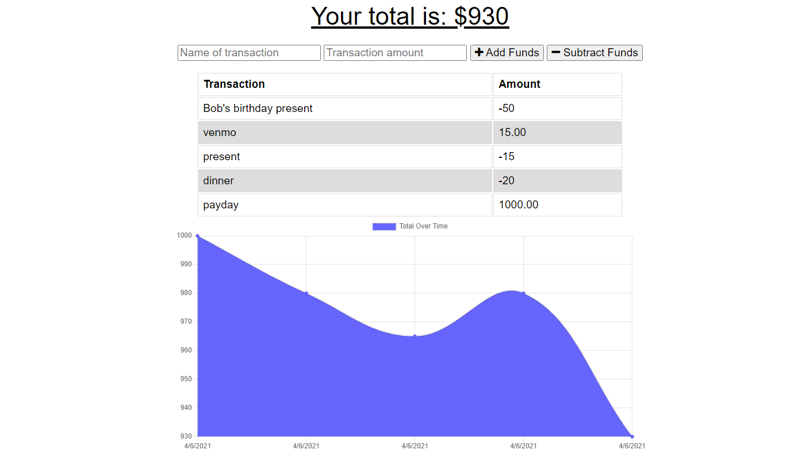

# Budget-Tracker

This is a simple budget tracker application. When you load the page you will see an area to type in the name of the tranaction. Then in the next box you will type the amount for the transaction. Then you will click to either add the funds to your account or to subtract the funds. When you do the graph below with automatically update depending on the transaction. 

